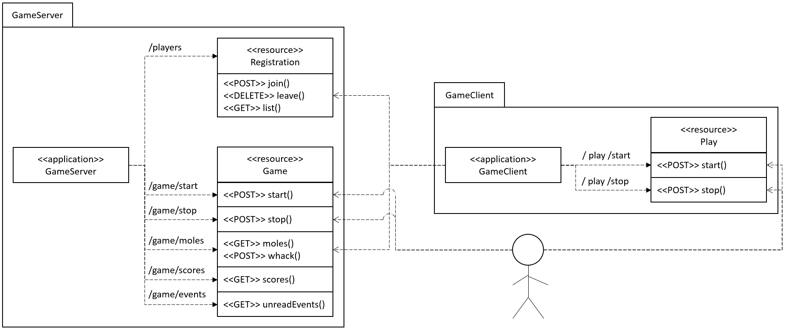
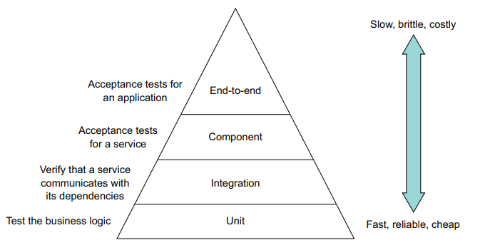
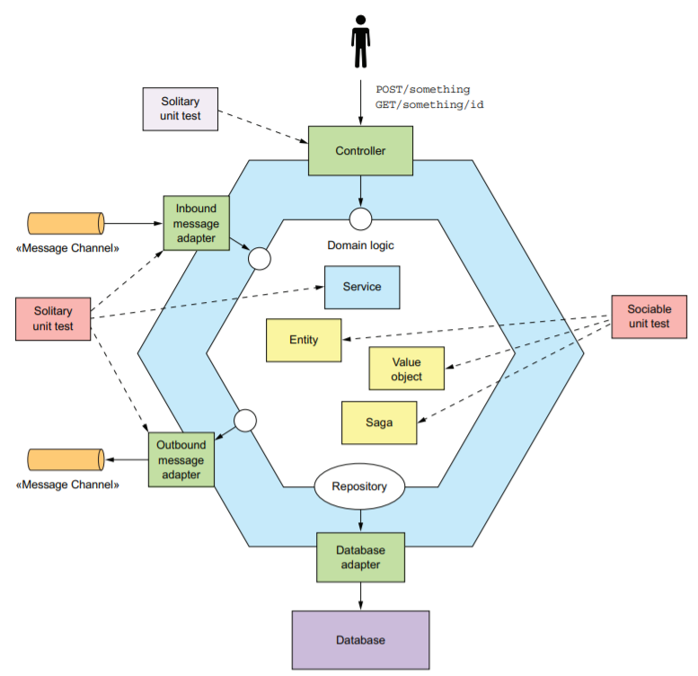

# Testing Microservices
Approach taken from "Microservices Patterns" by Chris Richardson.

## What Are We Testing?
A very simple system that requires inter-service communication.

### Whack-A-Mole
Whack-A-Mole consists of a Game Server and a Game Client. The Game Server is responsible for registering players, starting and stopping the game, creating moles, and keeping score. The Game Client is responsible for joining and leaving the game, retrieving a list of "unwhacked" moles and attemping to whack those moles.

<a href="./readme-resources/architecture.png" target="_blank">
    
</a>

## Test Approach
<a href="./readme-resources/test-pyramid.png" target="_blank">
    
</a>

### Unit Testing
Unit tests test the business logic of the application. There are two types of unit test:
- Solitary unit test: tests a class in isolation, using mock objects for the class's dependencies
- Sociable unit test: tests a class and its dependencies

Classes on the periphery of the architecture, for example, Controllers or Message Handlers, and infrastructure classes, such as Services, are generally tested with Solitary unit tests. Domain objects, such as entities and value objects, are typically tested with sociable unit tests, made possible because, ideally, they only depend on other Domain classes.

<a href="./readme-resources/package-structure.png" target="_blank">
    
</a>

#### Code Examples
Examples of unit tests in the GameClient are:
- uk.co.triad.test.testpyramid.whackamole.gameclient.domain.PlayerTest (Sociable)
- uk.co.triad.test.testpyramid.whackamole.gameclient.services.PlayerCommandQueryServiceTest (Solitary)

Although PlayerTest tests a Domain class, and as such is a Sociable unit test, it still requires mocking of the interface that talks to GameServer, which is injected into some of its method calls.

Examples of unit tests in the GameServer are:
- uk.co.triad.test.testpyramid.whackamole.gameserver.core.domain.GameTest (Sociable)
- uk.co.triad.test.testpyramid.whackamole.gameserver.core.domain.MoleTest (Sociable)
- uk.co.triad.test.testpyramid.whackamole.gameserver.core.domain.PlayerTest (Sociable)
- uk.co.triad.test.testpyramid.whackamole.gameserver.core.domain.ScoreTest (Sociable)
- uk.co.triad.test.testpyramid.whackamole.gameserver.core.services.GameCommandQueryServiceTest (Solitary)
- uk.co.triad.test.testpyramid.whackamole.gameserver.core.controllers.* (Solitary)
- uk.co.triad.test.testpyramid.whackamole.gameserver.core.controllers.dtos.mappers.* (Solitary)

### Integration Testing
Integration tests verify that a service can properly interact with infrastructure services, such as messaging and databases, and other services.

One way of integration testing is to launch all services and test them through their APIs. This, however, is what’s known as end-to-end testing, which is slow and brittle.

Instead, when testing communication from the GameClient to the GameServer, it is not done via the GameClient API, rather the test focusses on the class inside the GameClient service that is responsible for communicating with the GameServer - in this case, the GameServiceClient class. This way, the whole GameClient service is not inadvertently tested, so tests are simpler to write and quicker to execute.

To test the GameServiceClientTest class without launching the GameServer, the GameServer responses must be stubbed by the GameClient integration tests. This could be done by looking at the GameServer API and stubbing its responses appropriately, using a tool like WireMock, but the GameServer API would have to be monitored to ensure it doesn't change, thus causing the stubbed responses to be outdated.

#### Consumer-Driven Contract-Based Testing
A consumer contract test is an integration test for an API provider that verifies that its API matches the expectations of a consumer. The team that develops a consumer writes a contract test suite and adds it (for example, via a pull request) to the provider’s test suite. The developers of any other services that consume the API also contribute to the test suite. Each contribution will test those aspects of the API that are relevant to each consumer.

In this example, rather than the consumer of the API, in this case the GameClient, monitoring the GameServer API, it is the responsibility of the GameClient developers to add integration tests to the GameServer project for the API end-points that GameClient is using.

This could be done by manually writing unit test for the Controllers in the GameServer project, and writing the reciprocal WireMock stubs in the GameClient project. However, Spring Boot makes this simpler with Spring Cloud Contract.

The GameClient service only calls the following end-points:
```java
public interface GameService
{
  CompletionStage<Void> register(String playerName);

  CompletionStage<Void> deregister(String playerName);

  CompletionStage<List<Mole>> activeMoles();

  CompletionStage<Boolean> whack(String playerName, Mole mole);
}
```
As there are no other services that call GameServer, we should only expect to see Consumer-Driven contracts for those four end-points in the GameServe test suite.

##### GameServer
To test the GameServer API that is consumed by GameClient, a Groovy (or YAML) file must be created in the GameServer test suite (by the GameClient developers). To test the API, four groovy files (one for each endpoint) were added to `GameServer/core/src/test/resources/contracts/gameclient/`. Notice the folder ends in the name of the consuming service, so the producer knows whose using the API.

The contract for `CompletionStage<Void> register(String playerName);` looks like this:
```groovy
package contracts.gameclient.registration

import org.springframework.cloud.contract.spec.Contract
[
        Contract.make {
            name("should register a new player")
            request {
                method POST()
                url '/players'
                body(
                        [
                                "playerName": "nonExistentPlayer"
                        ]
                )
                headers {
                    contentType('application/json')
                }
            }
            response {
                status OK()
                async()
            }
        },
        // ...other tests
]
```

Aside from some Maven configuration, the dependencies of the Controller that implements the URLs had to be mocked: uk.co.triad.test.testpyramid.whackamole.gameserver.core.controllers.contracts.gameclient.RegistrationContractBaseTest.

Now, when the GameServer project is built, two things happen:
- Unit tests for the Controller that implements the URLs are automatically generated and run - thus testing the contract for the API producer (GameServer)
- A jar file is created that is an http server that acts as stub of the GameServer API, as defined by the contracts, which will be used by the API consumer (GameClient).

##### GameClient
Once the GameServer has been built, with the consumer-driven contracts included, the GameClient can create its integration tests, to test communication between itself and GameServer.

The integration test file is annotated with `@AutoConfigureStubRunner`, which defines the location of the http stub server created in the previous step, which, when called by the integration tests, returns the expected responses. These responses are used to confirm whether the GameServer API is still responding as expected by the GameClient.

#### Code Examples
The API producer contracts are defined in:
- GameServer/core/src/test/resources/contracts/gameclient/*

The mocked reponses for the contracts are defined in:
- uk.co.triad.test.testpyramid.whackamole.gameserver.core.controllers.contracts.RegistrationContractBaseTest
- uk.co.triad.test.testpyramid.whackamole.gameserver.core.controllers.contracts.GameContractBaseTest

The integration tests for the client are defined in:
- uk.co.triad.test.testpyramid.whackamole.gameclient.services.GameServiceClientTest

There are no integration tests for GameServer, because it doesn't talk to any other services, nor does it use a database (it doesn't integrate with anything else).

### Component Testing
So far, testing has covered individual classes and integration at the periphery. Component tests treat a service as a black box and verify its behaviour through its API. They are the Acceptance Tests for the service.

Component tests are not end-to-end tests, as they test the service in isolation. They replace services' dependencies with stubs that simulate their behavior, or use in-memory versions of infrastructure services such as databases.

There are two types of Component test:
- In-Process
- Out-Of-Process

An _in-process_ component test runs the service with in-memory stubs and mocks for its dependencies. For example, you can write a component test for a Spring Boot-based service using the Spring Boot testing
framework. A test class, which is annotated with @SpringBootTest, runs the service in the same JVM as the test. It uses dependency injection to configure the service to use mocks and stubs. In-process tests are simpler to write and faster, but have the downside of not testing the deployable service.

An _out-of-process_ component test packages the service in a production-ready format and runs it as a separate process. An out-of-process component test uses real infrastructure services, such as databases and message brokers, but uses stubs for any dependencies that are application services. Although this type of test is more complex to write, slower to execute, and potentially more brittle than an in-process component test, a key benefit is that it improves test coverage, because what’s being tested is much closer to what’s being deployed. This example uses out-of-process component tests.

Maven's Surefire plugin runs tests by searching for files matching `**/Test*.java, **/*Test.java, **/*Tests.java, **/*TestCase.java`, whereas Maven's Failsafe looks for files matching `**/IT*.java, **/*IT.java, **/*ITCase.java`. With a small amount of configuration of the POM file, the build process will package and run the Spring Boot application at the pre-integration phase, run the Failsafe tests in the integration phase against the running application, then shutdown the Spring Boot application at the post-integration phase. _N.B. although Failsafe runs during Maven's integration phase, the above integration tests are run with the Surefire plugin (the unit test phase). Maven's integration phase will run the Component tests._

As Component tests are Acceptance Tests, they can be written in Gherkin. However, for this example project, I have written them in code, but in a Given-When-Then style. Given they are Acceptance Tests, they should be reference a User Story (where applicable), and the tests should exercise scenarios.

#### Code Examples
Examples of component tests in the GameServer are:
- uk.co.triad.test.testpyramid.whackamole.gameserver.core.GameServiceComponentTestIT

There are no examples of component tests in the GameClient because time is precious and the above demonstrates it well enough (and the API is only `start()` and `stop()`, so it wouldn't be very interesting anyway).

## Conclusion
It might seem like a lot of testing compared to the all-too-common experience of the developer writing the code and the unit tests, then handing over to the "Testers", for them to write the tests. However, the tests still need to be written, but this way, rather than the tests being in a separate project and being run after code has been committed, tests are now committed at the same time as feature code, as part of the same project, thus proving new changes haven't broken previous work. Although the tests are being committed at the same time as the feature code, there's nothing to stop a member of the development team with test experience (a "Tester", if you like) either writing the tests, or guiding others in how to write the tests.

What's more, I've just realised I haven't actually run the system end-to-end yet. I've come this far, even documented the testing approach and the tests, but I've only exercised the tests (not even any end-to-end tests)! Will the system work as expected? Will I be able to get a GameClient to join a game and start whacking moles? And will I be able to see multiple clients compete and their scores increase? In short, does the system work?
<br />
...
<br />
No. But only because the GameClient was calling the GameServer too frequently, which swamped GameServer such that it became unavailable - maybe I should have put in some end-to-end tests (I would have in production). However, once that small problem was fixed, the services ran together perfectly: the testing had proven the business logic of the services and their integration to the extent that (after the calling frequency was fixed) they ran together as expected!

## Running the System
### Build
- GameServer: in `whack-a-mole/gameserver/core`:
  - run `mvn package`
- GameClient: in `whack-a-mole/gameclient/`:
  - run `mvn package`

### Run
- GameServer: in `whack-a-mole/gameserver/core`:
  - run `java -jar .\target\game-server-1.0-SNAPSHOT.jar --server.port=7000`
- GameClient: in `whack-a-mole/gameclient/`:
  - run `java -jar .\target\game-client-1.0-SNAPSHOT.jar --player.name=playerone --server.port=7100`
  - run `java -jar .\target\game-client-1.0-SNAPSHOT.jar --player.name=playertwo --server.port=7101`

#### Start the game
Start the game running on the GameServer:
- Open Swagger UI in browser: http://localhost:7000/swagger-ui.html, then POST `/game/start`

Start the players playing:
- Open Swagger UI in browser: http://localhost:7100/swagger-ui.html, then POST `/play/start`
- Open Swagger UI in browser: http://localhost:7101/swagger-ui.html, then POST `/play/start`

#### View Scores
- http://localhost:7000/swagger-ui.html > GET `/game/scores`

#### Stop the game
Stop the Game:
- http://localhost:7000/swagger-ui.html > POST `/game/stop`
- http://localhost:7000/swagger-ui.html > GET `/game/scores`

Stop the Players:
- http://localhost:7100/swagger-ui.html > POST `/play/stop`
- http://localhost:7101/swagger-ui.html > POST `/play/stop`
